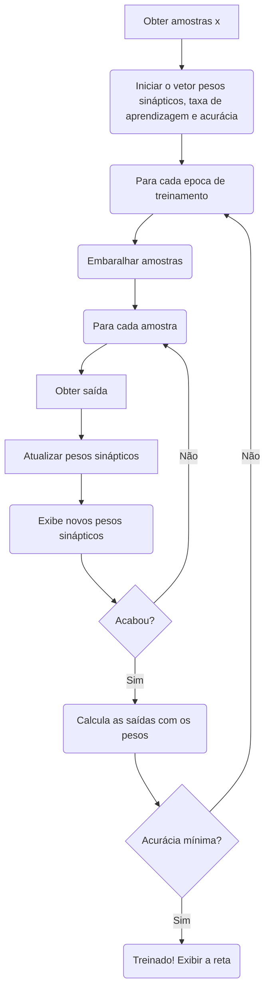

<!--
title: Perceptron
link: /blog/computing/perceptron
categoryTitle: Computação
categoryLink: /blog/computing
tags: [Redes Neurais, Matemática, Inteligência Artificial]
authorNick: taffarel55
authorName: Maurício Taffarel
authorId: 18634201
description: Esta é uma descrição em português
date: "2012/10/22"
time: 35
-->

# Implementação do Perceptron

## Introdução

A aprendizagem de máquina (Machine Learning) tem ganhado destaque nos últimos anos. Vivemos num mundo em que cada vez mais as inteligências artificiais estão mais presentes. Assistentes virtuais, carros autônomos, reconhecimento facial, detectores de _spam_, sistemas de recomendação, atendimento ao cliente, GPS com monitoramento de trânsito em tempo real e até mesmo o seu uso na medicina são alguns dos exemplos de aplicação da inteligência artificial no nosso dia a dia.

Além disso, pode-se notar um crescimento no número de artigos em conferências, periódicos e revistas que tratam sobre o tema além do interesse das suas aplicações na Indústria 4.0. Segundo dados do IDC (2021), entre as organizações de grande porte no Brasil, cerca de 1/4 estão já estão utilizando IA e Machine Learning (ML) em projetos próprios. Além disso, os gastos com AI no Brasil chegarão ao total de **US$ 464M** em 2021[^idc].

Este trabalho tem como finalidade apresentar uma rede neural mais basal, o _Perceptron_, seu modelo matemático, como ocorre o processo de aprendizagem, o algoritmo que o implementa e como ele pode ser utilizado para classificação binária.

## Neurônio

### O neurônio biológico

O neurônio biológico é uma célula com uma função especializada na transmissão de informações. Os neurônios são capazes de receber e transmitir impulsos nervosos para outros neurônios através das sinapses químicas e elétricas. Este tipo de célula apresentam diversas estruturas, dentre as quais, podemos citar quatro estruturas principais de acordo com as suas funções.[^livrobio]

<center>


##### Figura 1: Estrutura do neurônio biológico[^imgneuronio]

</center>

Os **dendritos** são um conjunto de ramificações responsáveis por receber impulsos nervosos de outros neurônios e por transmitir para o corpo celular.

O **corpo celular** é a parte do neurônio que contém o núcleo e o citoplasma que envolve o núcleo. Esta estrutura é responsável por receber os impulsos nervosos dos dendritos e processar a informação, os sinais recebidos podem ser excitatórios ou inibitórios e a soma destes sinais determina se o neurônio vai ser excitado e se irá disparar um impulso nervoso para o axônio.

E por último, o **axônio** é responsável pelo transporte deste sinal até as **terminações do axônio**, que por sua vez, transmite estes sinais às células-alvo que são outros neurônios, ou até mesmos para músculos ou glândulas.[^sinapsesbio]

Desta forma, os neurônios estão conectados a outros neurônios através de estruturas complexas formando circuitos que juntos são capazes de processar informações formando as redes neurais.

### O neurônio matemático

Inspirado no que se sabia até o momento sobre o cérebro humano e o modelo do neurônio, foram realizadas diversas tentativas de realizá-lo matematicamente. O primeiro modelo que se tem registros é o dos pesquisadores McCulloch e Pitts no ano de 1943.[^historiaia] Mais tarde, inspirado nas pesquisas destes pesquisadores, em 1958, o cientista Frank Rosenblatt desenvolveu o que o mesmo denominou como _Perceptron_[^perceptronrosenblatt]. Este modelo realiza uma soma ponderada de diversas entradas e calcula a saída através de uma função de ativação.

<center>


##### Figura 2: Estrutura do neurônio artificial[^imgneuronioartificial]

</center>

Os impulsos elétricos dos neurônios no modelo artifical são representados pelas entradas $x_1, x_2, x_3, ... , x_n$. Há entradas que excitam mais ou menos o neurônio artificial. A influência de cada entrada é determinada pelos pesos sinápticos $\omega_{1j}, \omega_{2j},\omega_{3j},...,\omega_{nj}$ onde $j$ se refere ao neurônio de estudo e $n$ ao peso do terminal de entrada de mesmo índice, estes pesos podem ter diferentes intensidades (valor do peso), assim como sua característica excitatória ou inibitória (através do sinal do peso). O corpo celular é representado pelo somatório das entradas com seus respectivos pesos sinápticos, que serão aplicadas na função de ativação $\varphi$, adicionando também como argumento, um limiar de ativação $\theta_j$ para então produzir a saída do neurônio $o_j$, que seria em um neurônio biológico, a resposta do impulso enviada para o axiônio.

Assim, podemos definir as seguintes equações:

$$net_{j}\left(t\right)=\sum_{i=1}^{n}w_{ij}(t)\cdot x_{i}\left(t\right)$$

$$o_j\left(t\right)=\varphi\left(net_{j}\left(t\right)\ ,\ \theta\left(t\right)\right)$$

Algumas simplificações podem ser feitas para o caso do Perceptron e para facilitar a implementação computacional no próximo tópico. Como o limiar de ativação $\theta(t)$ é somado ao somatório $net_{j}(t)$ na função de ativação, então, incorpora-se este limiar a função $net_{j}(t)$:

$$net_{j}\left(t\right)=\theta(t) +\sum_{i=1}^{n}w_{ij}(t)\cdot x_{i}\left(t\right)$$

Geralmente a função de ativação que determina a saída do neurônio artifical é escolhida de forma que $o(t) \in [-1, 1]$, como o _Perceptron_ é utilizado para reconhecimento de padrões e classificação de dados, entre duas amostras, sua saída apresenta duas possibilidades de valores: _verdadeiro_ ou _falso_, podendo ser representado pela função degrau ou degrau bipolar, neste caso consideramos a função degrau bipolar para determinar a saída:

$$
o_j\left(t\right)=\varphi\left(net_{j}(t)\right)=
\begin{cases}
1,  & \text{se $net_{j}(t)\ge0$} \\
-1, & \text{se $net_{j}(t)<0$}
\end{cases}
$$

Neste caso, o limite da condição ou threshold é definido quando $net_{j}(t)=0$, ou seja, quando $\theta(t) +\sum_{i=1}^{n}w_{ij}(t)\cdot x_{i}\left(t\right)=0$. Ao considerar $n=2$, fazendo o _Perceptron_ ter duas entradas obtemos o seguinte limite de condição:

$$x_1(t)\cdot\omega_{1j}(t) + x_2(t)\cdot\omega_{2j}(t) + \theta(t) = 0$$

Fica claro que a fronteira de decisão do _Perceptron_ é uma equação linear, podendo separar classes de amostras (desde que sejam separáveis).

<center>


##### Figura 3: Classificação de entradas para n=2 [^imgclassificacao]

</center>

A extrapolação pode ser feita para outros valores de $n$, para o caso de $n=3$ (3 dimensões) tem-se um plano para o fronteira de classificação, para valores superiores, um hiperplano.

### Treinamento do Perceptron

O processo de aprendizagem de um _Perceptron_ se dá através do ajuste de pesos sinápticos. Tomando um conjunto de amostras de entradas e de saídas, diz-se que uma rede neural "aprendeu", quando é capaz de determinar os pesos sinápticos e o limitar de ativação de tal forma que para todas (ou para quase todas) as entradas de amostras, as saídas determinadas pelo neurônio artificial são iguais às saídas de amostra. O processo de aprendizagem de uma rede neural é chamado de treinamento.

O processo de treinamento pode ser realizado de acordo com a regra de aprendizado de Hebb:

> When an axon of cell A is near enough to excite a cell B and repeatedly or persistently takes part in firing it, some growth process or metabolic change takes place in one or both cells such that A’s efficiency, as one of the cells firing B, is increased.[^hebb] > [name=Donald Hebb] [time=1949, pag 62] [color=#907bf7]

O algoritmo incrementa (ou decrementa) ao peso e ao limiar de ativação um valor proporcional à diferença entre a saída obtida e a saída esperada e aos sinais de entrada caso estas saídas tenham valores diferentes. Este processo é repetido até que todas as amostras (ou boa parte delas) para o treinamento tenham as respostas de saídas iguais às respostas esperadas.

Matematicamente isso pode ser definido como:

$$
\begin{cases}
\mathbf{\omega}_i^{atual} = \mathbf{\omega}_i^{anterior} + \eta \cdot(v^k - o^k)\cdot \mathbf{x}_i^k \\
\theta^{atual} = \theta^{anterior} + \eta \cdot(v^k - o^k) \\
\end{cases}
$$

Nestas equações foram omitidos os índices $j$ referentes ao neurônio em questão e ao parâmetro temporal, para simplificação, buscamos a implementação computacional de apenas um _Perceptron_ com pesos sinápticos invariantes no tempo. O valor desejado da amostra $k$ é denominado como $v^k$. Além disso, nota-se a presença de um fator $\eta$ no incremento (ou decremento) dos pesos e limiar, este fator é denominado taxa de aprendizagem, que define a velocidade de convergência do treinamento, quanto maior esta taxa, mais rápido a rede aprenderá e vice e versa, contudo, um $\eta$ muito grande pode causar instabilidades no processo de treinamento, normalmente a taxa de aprendizagem da rede é escolhido entre o intervalo $0 < \eta < 1$.

### Algoritmo do Perceptron

Como o limiar de ativação também é uma variável de ajuste podemos tratar esta variavel como se fosse um peso sináptico $w_0$ simplificado as equações anteriores para a equação abaixo:

$$
\mathbf{\omega}_i^{atual} =\mathbf{\omega}_i^{anterior} + \eta \cdot(v^k - o^k)\cdot \mathbf{x}_i^k
$$

E em notação computacional:

$$
\omega \leftarrow \omega + \eta \cdot(v^k - o^k)\cdot \mathbf{x}^k
$$

onde:

- $\omega = [\theta \,\,\, \omega_1 \,\,\, \omega_2 \,\,\, \omega_3 \,\,\, ... \,\,\, \omega_n]^{T}$
- $x^{k} = [1 \,\,\, x_1 \,\,\, x_2 \,\,\, x_3 \,\,\, ... \,\,\, x_n]^{T}$

Desta forma, a implementação do computacional pode ser feita de acordo com o seguinte algoritmo:



<center>

##### Figura 4: Algoritmo de treinamento do Perceptron

</center>

## Implementação computacional

Uma vez determinado o algoritmo, segue-se para usa implementação. A linguagem de programação utilizada será o R.

O primeiro passo consiste em se gerar aleatoriamente dois conjuntos de amostras, para este exemplo, as classes serão bolas verdes e vermelhas.

O seguinte trecho de código gera 100 bolas verdes e vermelhas pseudoaleatoriamente através de uma distribuição uniforme:

```python=1
N = 50 # Número total de pontos de cada classe

verde_x = runif(N, min = 0.4, max = 1)
verde_y = runif(N, min = 0.4, max = 1)

vermelho_x = runif(N, min = 0, max = 0.6)
vermelho_y = runif(N, min = 0, max = 0.6)

amostras_x = c(verde_x, vermelho_x)
amostras_y = c(verde_y, vermelho_y)
amostrasSaidas = c(rep(-1,N), rep(1,N))

par(pty="s")
plot(amostras_x, amostras_y, main='Amostras iniciais',
     type='n', xlab='X', ylab='Y')
points(verde_x, verde_y, col='green')
points(vermelho_x, vermelho_y, col='red')
```

Um resultado para a execução do código anterior é:

<center>


##### Figura 5: Dados iniciais para o treinamento

</center>

Seguindo o algoritmo da [figura 4](#Figura-4-Algoritmo-de-treinamento-do-Perceptron), inicia-se o vetor pesos sinápticos, define-se a taxa de aprendizagem e a acurácia de parada.

```python=19
w0 = 0.1          # Limiar de ativação
w1 = 0.2          # Peso x inicial
w2 = 0.3          # Peso y inicial

M = 50            # Numero de épocas
eta = 0.1         # Taxa de aprendizagem da rede
ac = 0.93         # Acurácia para parar
temErro = F       # Flag para imprimir respostas
```

Ainda de acordo com o algoritmo da [figura 4](#Figura-4-Algoritmo-de-treinamento-do-Perceptron), realiza-se o treinamento com a contagem das épocas e duas condições para paradas: 1) Obter uma acurácia igual ou superior da desejada; 2) Limite de épocas alcançado.

```python=28
for (i in 1:M){
  print(paste('Época: ', i))

  index = 1:(2*N)
  index = sample(index) # Embaralhar amostras

  for (j in index){
    u_j = w0 + w1*amostras_x[j] + w2*amostras_y[j]
    if (u_j >= 0){
      y_j = 1
    } else {
      y_j = -1}

    w0 = w0 + eta*(amostrasSaidas[j] - y_j)*1.0
    w1 = w1 + eta*(amostrasSaidas[j] - y_j)*amostras_x[j]
    w2 = w2 + eta*(amostrasSaidas[j] - y_j)*amostras_y[j]

    if (temErro == T){
      print(paste('  -> Atualizando ', j, ' : '))
      print(paste('     -> w0: ' ,w0))
      print(paste('     -> w0: ' ,w1))
      print(paste('     -> w0: ' ,w2))
    }
  }
  y_all = w0 + w1*amostras_x + w2*amostras_y
  y_pred = y_all
  y_pred[y_all >= 0] = 1
  y_pred[y_all< 0] = -1

  acc = sum(y_pred == amostrasSaidas)/length(amostrasSaidas)
  print(paste('Final da época: ', i, ' com: ', acc, '% de acurácia'))
  if (acc >= ac){
    break
  }
}
```

Ao fim da execução deste código, espera-se que o algoritmo tenham conseguido ajustas os pesos sinápticos e o limiar de ativação apresentando boa acurácia (maior do que a desejada).

E por último, para exibir a reta que define o limiar de classificação, executamos o último trecho de código:

```python=64
y_all = w0 + w1*amostras_x + w2*amostras_y
y_pred = y_all
y_pred[y_all >= 0] = 1
y_pred[y_all< 0] = -1

acc = sum(y_pred == amostrasSaidas)/length(amostrasSaidas)

plot(main='Reta de classificação obtida', amostras_x, amostras_y,
     type='n', xlab='X', ylab='Y')
points(verde_x, verde_y, col='green')
points(vermelho_x, vermelho_y, col='red')
abline(a = -1.0*w0/w2, b = -1.0*w1/w2, col='purple', lwd=3, lty=2)
legend(0,1,legend = acc, col='purple', lwd=3)
print (acc)
```

Um possível resultado obtido é:

<center>


##### Figura 6: Resultado do treinamento, reta de classificação com acurácia de 95%

</center>

[^idc]: 10 PREVISÕES DE TIC PARA 2021, 2021, Online. Evento [...]. [S. l.: s. n.], 2021. Disponível em: http://www.idclatin.com/2021/events/02_04_br/na.html. Acesso em: 6 set. 2021.
[^imgneuronio]: Disponível em: "<https://www.sobiologia.com.br/conteudos/FisiologiaAnimal/nervoso2.php>". Acesso em 8 set. 2021.
[^livrobio]: David E. Sadava, David M. Hillis, H. Craig Heller, and May Berenbaum, "How Do Neurons Communicate with Other Cells?" em Life: The Science of Biology, 9th ed. (Sunderland: Sinauer Associates, 2009), 961.
[^sinapsesbio]: Alberto E. Pereda, "Electrical Synapses and Their Functional Interactions with Chemical Synapses," Nature Reviews Neuroscience 15 (2014): 250-263, http://dx.doi.org/10.1038/nrn3708.
[^historiaia]: Jürgen Schmidhuber, Deep learning in neural networks: An overview, Neural Networks, Volume 61, 2015, Pages 85-117, ISSN 0893-6080, https://doi.org/10.1016/j.neunet.2014.09.003.
[^imgneuronioartificial]: Disponível em: "<https://commons.wikimedia.org/wiki/File:ArtificialNeuronModel.png>". Acesso em 8 set. 2021.
[^perceptronrosenblatt]: Rosenblatt, F. (1958). The perceptron: A probabilistic model for information storage and organization in the brain. Psychological Review, 65(6), 386–408. https://doi.org/10.1037/h0042519
[^imgclassificacao]: Silva, Ivan Nunes da Redes neurais artificiais: para engenharia e ciências aplicadas / Ivan Nu-nes da Silva; Danilo Hernane Spatti; Rogério Andrade Flauzino. – São Paulo: Artliber, 2010.
[^hebb]: Hebb, D. O. (1949). The organization of behavior. New York: Wiley
