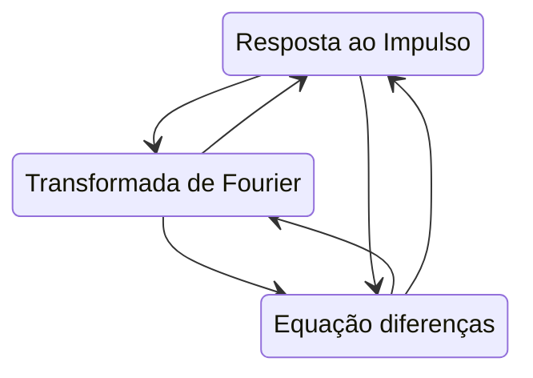

<!--
title: "Blog"
link: "/blog"
author: taffarel55
date: 22-10-2012
-->

# Resumo Sinais II

Resumo + Formulário feito por Breno Amin e adaptado por Maurício Taffarel feito com muito carinho :heart:

## ~~Possíveis questões que vão cair na prova:~~

## Questões legais para treinar:

- Questão de Convolução
- Questão de Fourier
- Questão de Resposta em frequência
- Questão de Filtros
- Questão de Métodos dos coeficientes a determinar

## Aula 1 - Fundamentos

- [ ] Saber determinar o período fundamental se a sequência discreta for periódica

$$\Omega_{0}N=2\pi m$$

> Na lista 1 tem exemplos que trabalham isso

## Aula 2 - Somatório de Convolução

- [ ] Saber determinar intervalos da convolução
- [ ] Saber fazer convolução

$$x[n]∗h[n]=\sum_{k=-\infty}^{\infty}x\left[k\right]h\left[n-k\right]$$

$$\sum_{n=N_{1}}^{N_{2}}\alpha^{n}=\frac{\alpha^{N_{2}+1}-\alpha^{N_{1}}}{\alpha-1}\space com\space N_{2}>N_{1}\ e\ α\neq 1$$

> No slide tem um exemplo muito bom
> A lista 1 também tem exemplos que trabalham isso

## Aula 3 - Série de Fourier de Tempo Discreto

- [ ] Saber utilizar Equação de Síntese e a Equação de Análise
- [ ] Lembrar que Sinais reais apresentam simetria na frequência

$$x[n]=\sum_{k=<N_{0}>}^{ }a_{k}e^{jk\left(\frac{2\pi}{N_{0}}\right)n}$$

$$a_{k}=\frac{1}{N_{0}}\sum_{n=<N_{0}>}^{ }x\left[n\right]e^{-jk\left(\frac{2\pi}{N_{0}}\right)n}$$

> Na lista 1 tem exemplos
> No slide também tem alguns exemplos

## Aula 4, 5 e 6 - Transformada de Fourier e Resposta em frequência

- [ ] Saber transistar entre a resposta em frequência, resposta ao impulso e equações de diferenças
- [ ] Saber como trabalhar com equações diferenças com impulsos.

$$x\left[n\right]=\frac{1}{2\pi}\int_{2\pi}^{ }X\left(e^{j\Omega}\right)e^{j\Omega n}d\Omega$$

$$X\left(e^{j\Omega}\right)=\sum_{n=-\infty}^{\infty}x\left[n\right]e^{-j\Omega n}$$

$$H\left(e^{j\Omega}\right)=\frac{b_{0}+b_{1}e^{-j\Omega}+...b_{N}e^{-j\Omega N}}{a_{0}+a_{1}e^{-j\Omega}+...a_{M}e^{-j\Omega M}}=\frac{\sum_{k=0}^{N}b_{k}e^{-jk\Omega}}{\sum_{k=0}^{M}a_{k}e^{-jk\Omega}}$$

> Slides tem exemplos
> Lista 1 tem exemplos disso também

## Aula 7 - Filtros em tempo discreto

- [ ] Trabalhar com filtros analisando a resposta em frequência
- [ ] Classificar se ele é passa alta, passa baixa, calcular algum parâmetro de ajuste
- [ ] Reconhecer a equação de um média-móvel e saber utilizar ela

$$H_{PA}(e^{j\Omega})=H_{PB}(e^{j(\Omega-\pi)}) \implies h_{PA}[n]=e^{j\pi n}h_{PB}[n]=(1)^{n}h_{PB}[n]$$

$$H\left(e^{j\Omega}\right)=\frac{e^{j\Omega\left(N-M\right)/2}}{N+M+1}\frac{sen\left(\Omega\left(M+N+1\right)/2\right)}{sen\left(\Omega/2\right)}$$

$$y[n]=\frac{1}{N+M+1}\sum_{k=-N}^{M}x\left[n-k\right]$$

- Filtro passa-baixas com resposta de fase linear.
- Se $(N - M)/2 = m$ com $m$ um inteiro negativo. Então $m$ é um simples atraso temporal.

## Aula 8 e 9 - Amostragem

- [ ] Entender que a amostragem pode ser obtida através da multiplicação de sinais.
- [ ] Entender a sobreposição espectral

$$x_{p}(t)=x(t)\cdot p(t)$$
$$p\left(t\right)=\sum_{n=-\infty}^{\infty}δ\left(t-nT\right)$$
$$X_{p}(jω)=\frac{1}{T}\sum_{k=-\infty}^{\infty}X\left(j\left(ω-kω_{s}\right)\right)$$

$$ω_{s}>2ω_{m}$$

## Aula 10 e 11 - Transformada Z

- [ ] Saber calcular a transformada e a inversa
- [ ] Saber calcular o valor inicial e o valor final de um sinal, a partir da transformada do sinal.
- [ ] Saber realizar o método da divisão direta

$$X(z)=\sum_{n=0}^\infty{x[n]z^{-n}}$$

$$x[n]=\frac{1}{2\pi j}\oint X(z)z^{n-1}dz$$

$$x[0]=\lim_{z\rightarrow\infty}{X(z)}$$
$$\lim_{n\rightarrow\infty}{x[\infty]}=\lim_{z\rightarrow 1}{(z-1)X[z]}$$

## Aula 12 - Descrição de sistemas

- [ ] Saber como obter a resposta à entrada nula e estado nulo iterativamente
- [ ] Saber como se resolve um sistema usando o método clássico.

$$y_{\eta}[n]+a_{1}y_{\eta}[n-1]+a_{2}y_{\eta}[n-2]+...+a_{M}y_{\eta}[n-M]=0\\y_{η}[-1]=y[-1],y_{η}[-2]=y[-2],...,y_{η}[-M]=y[-M]$$

$$
y_{\phi}[n]=-a_{1}y_{\phi}[n-1]-a_{2}y_{\phi}[n-2]-...-a_{M}y_{\phi}[n-M]\\+b_{0}x[n]+b_{1}x[n-1]+...+b_{N}x[n-N]\\
y_\phi[-1]=y_\phi[-2]=...=y_{\phi}[-M]=0
$$

## Aula 13 - Mapeamento s-z

- [ ] Saber como realizar o mapeamento s-z
- [ ] Conhecer as diversas aproximações de discretização:
  - Foward ($s'=\frac{z-1}{T}$)
  - Backward ($s'=\frac{z-1}{zT}$)
  - Tustin ($s'=\frac{2}{T}\frac{z-1}{z+1}$)

$$X(s)=X(z)|_{z=e^{sT}}$$

## Tabelas

### Propriedades Transformada de Fourier

|                     $x[n]$                      |                                                    $X(e^{j\Omega})$                                                     |
| :---------------------------------------------: | :---------------------------------------------------------------------------------------------------------------------: |
|              $ax_{1}[n]+bx_{2}[n]$              |                                              $aX_1(e^{jΩ}) + bX_2(e^{jΩ})$                                              |
|                  $x[n - n_0]$                   |                                               $e^{-jΩn_0}X(e^{j\Omega})$                                                |
|                 $e^{jΩn_0}x[n]$                 |                                               $X(e^{j(\Omega-\Omega_0)})$                                               |
|                     $x[-n]$                     |                                                    $X(e^{-j\Omega})$                                                    |
|                  $x^\ast[-n]$                   |                                                 $X^\ast(e^{-j\Omega})$                                                  |
|           $\sum_{m=-\infty}^{n}x[m]$            |     $\frac{X(e^{j\Omega})}{1-e^{-j\Omega}}+\pi X(e^{j0})\sum_{k=-\infty}^{\infty}\delta\left(\Omega-2\pi k\right)$      |
|                    $x[n/k]$                     |                                                      $X(e^{jkΩ})$                                                       |
|                     $nx[n]$                     |                                           $j\frac{dX(e^{j\Omega})}{d\Omega}$                                            |
| $\sum_{n=-\infty}^{\infty}\vert x[n]\vert ^{2}$ |                             $\frac{1}{2\pi}\int_{2\pi}^{ }\vert X(e^{j\Omega})\vert ^{2}dΩ$                             |
|             $y[n]=x[n]^{\ast}h[n]$              |                                      $Y(e^{j\Omega})=X(e^{j\Omega})H(e^{j\Omega})$                                      |
|                 $y[n]=x[n]h[n]$                 | $Y(e^{j\Omega})=\frac{1}{2\pi}\int_{2\pi}^{}X_{1}(e^{j\theta})X_{2}\left(e^{j\left(\Omega-\theta\right)}\right)d\theta$ |

### Transformadas Transformada de Fourier

|     $x[n]$      |                               $X(e^{j\Omega})$                                |
| :-------------: | :---------------------------------------------------------------------------: |
|   $\delta[n]$   |                                       1                                       |
|     $u[n]$      | $\frac{1}{1-e^{-j\Omega}} + \sum_{k=-\infty}^{\infty}\pi\delta(\Omega+2k\pi)$ |
| $e^{j\alpha n}$ |                            $2\pi\delta(\Omega+a)$                             |
| $cos(\alpha n)$ |              $\pi(\delta(\Omega-\alpha) +\delta(\Omega+\alpha))$              |
| $sen(\alpha n)$ |         $\frac{\pi}{j}(\delta(\Omega-\alpha) +\delta(\Omega+\alpha))$         |

### Propriedades Transformada Z

|             $x[n]$              |                       $X(z)$                       |
| :-----------------------------: | :------------------------------------------------: |
|            $x[n-m]$             | $x[-m]+x[-m+1]z^{-1}+...+x[-1]z^{-m+1}+z^{-m}X(z)$ |
|            $x[n+m]$             |   $-x[m-1]z^1-x[m-2]z^2-...-x[0]z^{m}+z^{m}X(z)$   |
|       $ax_1[n] + bx_2[n]$       |                $aX_1(z) + bX_2(z)$                 |
|       $x_1[n]\ast x_2[n]$       |                   $X_1(z)X_2(z)$                   |
| $\sum_{k=0}^{n}x\left[k\right]$ |        $\frac{1}{1-z^{-1}}X\left(z\right)$         |
|             $nx[n]$             |                $-z\frac{dX(z)}{dz}$                |

### Transformadas Z

###### tags: `UFBA` `Resumos`
